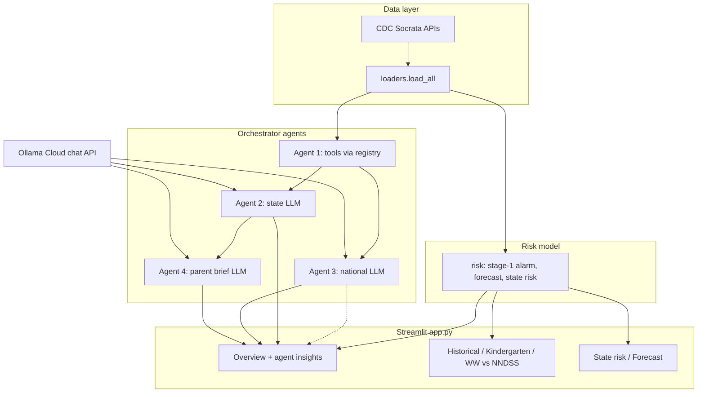

# Tool V2 — system architecture

**Workflow:** Update this document (if the shipped pipeline changes) **after** app freeze and deployment verification; the process diagram should match what you submit in the TOOL2 package. Sources: [`diagrams/architecture.mmd`](diagrams/architecture.mmd) (editable), Mermaid block below (same graph).

## Purpose

The **Predictive Measles Risk Dashboard** (Streamlit) loads CDC surveillance and coverage data, fits a risk model, and presents charts, maps, and forecasts. **Tool V2** adds **agentic orchestration**: CDC-backed tools run first; then LLM agents produce state-level, national, and parent-facing narratives grounded in that context.

## High-level flow

1. **Loaders** (`loaders/`) pull kindergarten coverage, wastewater, NNDSS, and related tables from public CDC endpoints (Socrata).
2. **Risk** (`risk/`) builds a stage-1 alarm model, national weekly aggregates, state risk scores, and forecast drivers used across tabs.
3. **Streamlit** (`app.py`) renders pages: Overview (with optional **AI agent insights** from the orchestrator), Historical, Kindergarten, Wastewater vs NNDSS, State risk, Forecast.
4. **Orchestrator** (`agents/orchestrator.py`) runs **Agent 1** (five registered tools in fixed order), then **Agents 2 & 3** in parallel (LLM), then **Agent 4** (LLM, depends on Agent 2). **Agent 2** produces state-level **history + current risk** (state-filtered tool rows + dashboard metrics). **Agent 4** rewrites **Agent 2’s output** for a parent audience. User messages prepend a **DASHBOARD METRICS** block (alarm, baseline tier, `data_as_of`). Prompts load from `prompts/*.md` via `prompts/loader.py`. LLM calls go through `ollama_client.py`: **OpenAI** Chat Completions if `OPENAI_API_KEY` is set (optional `OPENAI_MODEL`, default `gpt-4o-mini`), otherwise **Ollama Cloud** with model fallback starting with `gemma4:31b-cloud`.
5. **Contracts** (`contracts/schemas.py`) define `AgentContext`, `AgentResult`, `ToolOutput` for consistent payloads and tests.

## Process diagram (Mermaid)

The same diagram is stored as editable source in [`diagrams/architecture.mmd`](diagrams/architecture.mmd).

## Agent roles

| Agent | Role | Inputs | Output use |
|-------|------|--------|------------|
| 1 | Runs CDC tool wrappers (`child_vax`, `kindergarten_vax`, `teen_vax`, `wastewater`, `nndss`) via `tools/registry.py` | Per-tool parameters, session context | Structured `ToolOutput` payloads in `AgentContext` |
| 2 | State history + current risk | Dashboard metrics block + state-filtered rows + compact context | Overview state insight (sections A/B in prompt) |
| 3 | National / multi-source analyst | Dashboard metrics + compact context | Overview national insight |
| 4 | Parent-language interpretation of Agent 2 | Agent 2 text + metrics + excerpts + context | Overview family-facing insight |

Agent 4 is skipped with a clear error if Agent 2 does not succeed.

## Tool calling (implementation)

- **Registry:** `tools/registry.py` maps tool names to functions; returns `ToolOutput` aligned with schemas in [`INTERFACE_CONTRACTS.md`](INTERFACE_CONTRACTS.md).
- **No LLM-native tool calling:** tools are invoked deterministically by the orchestrator (Agent 1), not by the model choosing functions at runtime.

## Configuration and deployment

- **Local / Connect env:** `SOCRATA_APP_TOKEN` (optional); for LLM features set `OPENAI_API_KEY` (OpenAI) or `OLLAMA_API_KEY` (Ollama Cloud); optional `OPENAI_MODEL`. See `ollama_client.py` and `deployment/deploy_me.py`.
- **Deploy:** Posit Connect via `rsconnect-python`; see [`submission_notes.md`](submission_notes.md).

## Tests

- `tests/test_orchestrator.py` — tool order, LLM ordering, partial failure, state filtering.
- `tests/test_tools_live_parity.py` — tool outputs vs loaders (network).
- Other tests cover registry, schemas, and app-adjacent behavior.
