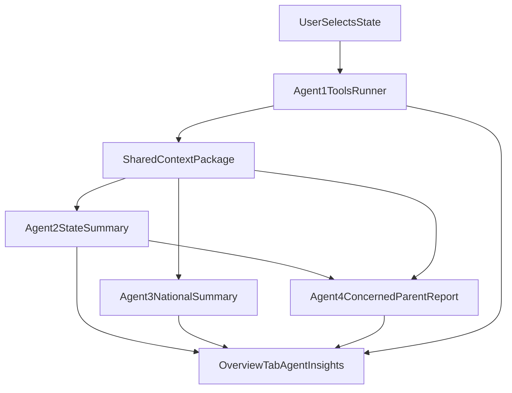

# App V2 Segmented Development Plan

## Goal and Scope
Build a new standalone App V2 by reusing the current Streamlit dashboard architecture and V1 data/API assets, then add:
- Tool-calling API layer (one tool per existing API domain)
- Multi-agent orchestration workflow (Agent 1-4 as defined)
- Per-section loading indicators and progressive result rendering
- Updated cloud model target (`gemma4:31b-cloud`)
- Submission-ready documentation package matching TOOL2 rubric

Primary reference files:
- [v2 scope planning.md](./v2%20scope%20planning.md)
- [TOOL2.md](./TOOL2.md)
- [c:/Users/jonyl/Documents/GitHub/ai-data-science-team-w/dashboard/app.py](c:/Users/jonyl/Documents/GitHub/ai-data-science-team-w/dashboard/app.py)
- [c:/Users/jonyl/Documents/GitHub/ai-data-science-team-w/dashboard/ollama_client.py](c:/Users/jonyl/Documents/GitHub/ai-data-science-team-w/dashboard/ollama_client.py)
- [c:/Users/jonyl/Documents/GitHub/ai-data-science-team-w/dashboard/loaders.py](c:/Users/jonyl/Documents/GitHub/ai-data-science-team-w/dashboard/loaders.py)
- [c:/Users/jonyl/Documents/GitHub/ai-data-science-team-w/dashboard/risk.py](c:/Users/jonyl/Documents/GitHub/ai-data-science-team-w/dashboard/risk.py)

## Segment 0 - Project Setup and Branching (Shared)
- Use current folder `Tool V2/` and copy only required assets from `dashboard/` and `Shiny App V1/` into an integrated file structure.
- Freeze baseline by running V1 dashboard and capturing screenshots and key outputs for regression checks.
- Define shared interfaces early:
  - `ToolInput` / `ToolOutput` schema
  - `AgentContext` payload structure
  - `AgentResult` schema for UI consumption
- Assign owners per segment and define handoff contracts (JSON shapes, expected latency, error format).

Verification checkpoint (local, pre-push):
- [x] Start V2 app locally and confirm it boots with copied baseline pages before adding new features.

## Segment 1 - Tool Layer (Backend Developer + Data Engineer)
Implement API calls as explicit tools (one tool per data source).

Planned tool modules (in V2 folder):
- `tools/child_vax_tool.py`
- `tools/kindergarten_vax_tool.py`
- `tools/teen_vax_tool.py`
- `tools/wastewater_tool.py`
- `tools/nndss_tool.py`

Requirements:
- Preserve existing input semantics used by current dashboards (backward compatibility).
- Each tool returns structured payload + metadata (`status`, `source`, `as_of`, `errors`).
- Add retries/timeouts and standardized error messages for orchestration layer.
- Build lightweight tool registry (`tools/registry.py`) for dynamic agent calls.

Definition of done:
- Each tool callable independently with mock and live tests.
- Existing V1-equivalent outputs available through new tool wrappers.

Verification checkpoint (local, pre-push):
- [x] Run unit tests for each tool wrapper and verify success/failure/error payload shape matches schema.
- [x] Execute each tool locally against live or fixture data and compare key fields to V1 outputs.
- [x] Validate registry lookup for all tool names and ensure unknown tool requests return controlled errors.

## Segment 2 - Agent Orchestrator and Multi-Agent Workflow (Agent Engineer)
Build a central orchestrator module (for example `agents/orchestrator.py`) with four agents:
- Agent 1: execute tools and produce normalized data package
- Agent 2: generate state-level summary from Agent 1 package + selected state
- Agent 3: generate national summary from Agent 1 package
- Agent 4: generate "concerned parent" report from Agent 1 + Agent 2 outputs

Workflow rules:
- Agent 1 runs first and publishes shared context.
- Agent 2 and Agent 3 run in parallel after Agent 1 completion.
- Agent 4 runs after Agent 2 completion (and may reference Agent 1 data).
- Support partial success: if one agent fails, render available outputs with warnings.

State management:
- Store each agent status in session state (`pending/running/success/error`).
- Persist latest successful payload to avoid blank UI during refreshes.

Verification checkpoint (local, pre-push):
- [ ] Run orchestrator integration tests validating execution order: Agent 1, then Agent 2/3 parallel, then Agent 4.
- [ ] Simulate one agent failure and confirm partial-success behavior returns non-failing agent outputs.
- [ ] Verify agent status transitions and persisted payload behavior in a local debug run.

## Segment 3 - UI Integration and Progressive Loading (Frontend Developer)
Integrate agent outputs into `Overview` tab below existing key metrics.

UI changes in V2 `app.py`:
- Add a dedicated "Agent Insights" section under metrics/gauge.
- Add independent loading indicators for each agent card.
- Add a loading indicator for all other pages of the dashboard
- Render each card immediately on completion (do not block on all agents).
- Add "Run/Refresh Agent Analysis" trigger and timestamp.
- Show clear fallbacks for missing data and tool/agent errors.

UX acceptance criteria:
- User can select state once and see state + national + parent outputs update coherently.
- Loading state visible for each agent individually.
- Dashboard remains responsive while agents execute.

Verification checkpoint (local, pre-push):
- [ ] Launch app locally and run Agent Insights flow; confirm each agent card shows independent loading and completion states.
- [ ] Confirm results appear progressively (first completed agent renders without waiting for others).
- [ ] Confirm existing Overview metrics, gauge, and non-agent sections still render unchanged.

## Segment 4 - Model and Prompt Update (Prompt Engineer)
Update model usage from current `OLLAMA_MODELS` in V2 client to prioritize `gemma4:31b-cloud`.

Tasks:
- Replace model preference order in V2 `ollama_client` equivalent.
- Define system prompts per agent role (clear constraints and output formats).
- Add guardrails: no fabricated numbers, quote source timestamps, short structured outputs.
- Add fallback model behavior and deterministic parsing strategy for UI display.

Validation:
- Agent outputs remain parseable and consistent across 3 repeated runs.
- Output includes role-appropriate language and stakeholder value framing.

Verification checkpoint (local, pre-push):
- [ ] Run 3 local prompt/model test cycles and verify structured output parsing succeeds every run.
- [ ] Confirm `gemma4:31b-cloud` is first-choice model and fallback only triggers on explicit failures.
- [ ] Validate responses include source-aware language and do not invent numeric values.

## Segment 5 - Testing, Compatibility, and Quality Gate (QA + Full Stack)
Testing focus:
- Backward compatibility with current dashboard views and metrics.
- Agent workflow ordering and parallelization behavior.
- Error handling (API timeout, empty result, missing env vars).
- UI rendering for incremental completion states.

Minimum test artifacts:
- `tests/test_tools_*.py` for tool wrappers
- `tests/test_orchestrator.py` for dependency flow and partial failure
- `tests/test_agent_output_schema.py` for output contracts
- Manual test checklist for Overview tab behavior and loading indicators

Release gate checklist:
- No regressions in existing tabs (Historical, Kindergarten, Wastewater vs NNDSS, State risk, Forecast).
- All four agent cards render or fail gracefully.
- Model key/env var errors are user-readable and logged.

Verification checkpoint (local, pre-push):
- [ ] Run full local test suite and targeted smoke tests for all tabs and agent workflows.
- [ ] Execute manual regression pass against Segment 0 baseline screenshots/metrics.
- [ ] Confirm no blocker defects remain open and release gate checklist is fully marked complete.

## Segment 6 - Deployment to Posit Connect (DevOps Engineer + Project Manager)
Deploy App V2 using `rsconnect-python` with `POSIT_PUBLISHER_KEY` for API authentication.

**Status:** Tooling and runbook are in place (`deployment/deploy_me.py`, `deployment/README.md`). **Outstanding:** run a real deploy, smoke-test the live URL, and record the URL for Segment 7.

Deployment tasks:
- [x] Install deployment tooling in local environment: `pip install rsconnect-python` (pinned in `deployment/requirements-deploy.txt`; use `pip install -r deployment/requirements-deploy.txt`).
- [x] Ensure deployment env vars are present locally and in deployment target:
  - `POSIT_PUBLISHER_KEY` / `CONNECT_API_KEY` / `POSIT_CONNECT_PUBLISHER` / `RSCONNECT_API_KEY` (publish auth; script loads from `.env` and documents aliases)
  - `SOCRATA_APP_TOKEN` (required for live CDC data)
  - `OLLAMA_API_KEY` (if AI features should work in deployed app)  
  *Implemented:* `deploy_me.py` auto-forwards `SOCRATA_APP_TOKEN` and `OLLAMA_API_KEY` to Connect via `rsconnect -E` when set locally; optional `--no-app-env` to skip. See `deployment/README.md`.
- [x] Configure and run `rsconnect deploy` for the V2 app entrypoint and requirements.  
  *Implemented:* `deployment/deploy_me.py` invokes `python -m rsconnect.main deploy streamlit` with `app.py`, `Tool V2/` bundle, `requirements.txt`, default server `https://connect.systems-apps.com/`, Python **3.12**, default excludes, and env forwarding. **Run** `python deployment/deploy_me.py` when ready (not yet executed as part of segment closure).
- [ ] Validate deployment metadata and capture deployed URL for documentation.
- [x] Add a short deployment runbook in repo docs (commands, required env vars, rollback notes).  
  *Location:* `deployment/README.md` (also `Tool V2/README.md` links the `deployment/` folder).

Verification checkpoint (local + deployed, pre-push):
- [x] Local dry run completes with valid `rsconnect` configuration and no missing required settings. (`python deployment/deploy_me.py --dry-run` exercises argv; API key still required for a real push.)
- [ ] Deployment succeeds to Posit Connect and returns a working app URL.
- [ ] Smoke test deployed app: Overview loads, at least one non-AI tab works, and agent sections fail gracefully if optional keys are absent.
- [ ] Record the live deployed URL for use in Segment 7 documentation.

## Segment 7 - Documentation Package for Submission (Project Manager + Documentation Owner)
Produce documentation to satisfy TOOL2 doc requirements and grading criteria. The deployed app URL from Segment 6 is now available for inclusion.

Deliverables:
- App description (3-5 paragraphs, stakeholder value explicit)
- Process diagram showing data flow + orchestration + tools
- Technical documentation:
  - System architecture
  - Tool definitions (name, purpose, params, return)
  - API keys/endpoints/packages/file layout/deployment details
  - Usage instructions for deployed app (using live URL from Segment 6)
- Team member role breakdown
- Final docx containing GitHub link + deployed app link + location pointers

Recommended documentation files in repo:
- `docs/DOCUMENTATION.md` (app description + usage)
- `docs/ARCHITECTURE.md`
- `docs/TOOLS.md`
- `docs/submission_notes.md`

Verification checkpoint (local, pre-push):
- [ ] Review docs locally for completeness against TOOL2 rubric items and required links.
- [ ] Validate process diagram matches implemented architecture and current agent/tool flow.
- [ ] Confirm final docx references the correct repo URL and the live deployed app URL from Segment 6.
- [ ] Confirm usage instructions are accurate against the deployed app.

## Push Policy Between Segments
- No segment branch is pushed until its local verification checkpoint passes.
- If checkpoint fails, fix in-branch and re-run only the failed checkpoint plus impacted prior checks.
- Require one teammate verification on checkpoint evidence (test output, screenshots, or checklist) before push.

## Execution Order (Strict Sequential)

Each segment is executed and validated in numerical order. No segment may begin until the prior segment's verification checkpoint is fully complete.

- [ ] **Segment 0** -- Project setup, baseline capture, interface contracts.
- [ ] **Segment 1** -- Tool layer. Depends on Segment 0 only.
- [ ] **Segment 2** -- Agent orchestrator. Depends on Segments 0-1 only.
- [ ] **Segment 3** -- UI integration. Depends on Segments 0-2 only.
- [ ] **Segment 4** -- Model and prompt update. Depends on Segments 0-3 only.
- [ ] **Segment 5** -- Testing and quality gate. Validates integrated behavior of Segments 0-4.
- [ ] **Segment 6** -- Posit Connect deployment. Depends on validated app from Segments 0-5.
- [ ] **Segment 7** -- Documentation package. Depends on Segments 0-6; uses live deployed URL from Segment 6.

Rules:
- [ ] Execute and validate in order: 0 -> 1 -> 2 -> 3 -> 4 -> 5 -> 6 -> 7.
- [ ] Do not start a segment until the prior segment's checkpoint is fully complete.
- [ ] No segment requires a future segment to pass its own checkpoint.

## Architecture Flow (Mermaid)

## Ownership and Handoff Model
- Tool layer owner hands off stable tool registry + schemas to orchestration owner.
- Orchestration owner hands off standardized agent result payloads to frontend owner.
- Frontend owner hands off UI screenshots + behavior checklist to QA.
- QA signs release gate, then DevOps deploys to Posit Connect.
- Documentation owner writes final docs using the live deployed URL from DevOps.

## Risks and Mitigations
- API instability or latency: use retries, caching, and partial rendering.
- Agent output inconsistency: enforce strict response templates and schema validation.
- Integration churn across teammates: freeze payload contracts before UI work.
- Deployment drift: keep `.env` requirements explicit and test in deployment-like environment early.