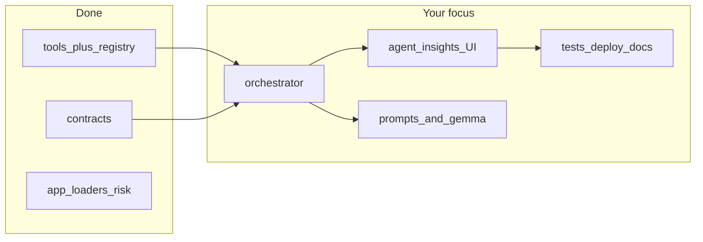

# Continue Tool V2 from co-developer baseline

*Copy of the continuation plan; paths below are relative to the `Tool V2/` directory (parent of `sandbox/`).*

## What is already done (build on this)

- **Segment 0 – contracts and layout:** [`contracts/schemas.py`](../contracts/schemas.py) defines `ToolInput`, `ToolOutput`, `AgentContext`, `AgentResult`; [`docs/INTERFACE_CONTRACTS.md`](../docs/INTERFACE_CONTRACTS.md) documents registry names and JSON shapes.
- **Segment 1 – tool layer:** [`tools/registry.py`](../tools/registry.py) (`run_tool`, registered tools), per-tool modules under [`tools/`](../tools/), tests under [`tests/test_tools_*.py`](../tests/) and [`test_registry.py`](../tests/test_registry.py), [`test_tool_output_schema.py`](../tests/test_tool_output_schema.py).
- **Dashboard parity:** [`app.py`](../app.py), [`loaders.py`](../loaders.py), [`risk.py`](../risk.py) mirror the original dashboard behavior (no multi-agent wiring yet).
- **Segment 6 – deploy prep:** [`deployment/deploy_me.py`](../deployment/deploy_me.py), [`deployment/README.md`](../deployment/README.md); plan says **real deploy + smoke test URL** still outstanding.
- **Stubs / placeholders:** [`agents/orchestrator.py`](../agents/orchestrator.py) is only a docstring placeholder; [`ui/README.md`](../ui/README.md) and [`prompts/README.md`](../prompts/README.md) describe intended files but they are not implemented.



---

## Phase A — Segment 2: Orchestrator (detailed)

**Goal:** Implement the workflow in [`INTERFACE_CONTRACTS.md`](../docs/INTERFACE_CONTRACTS.md): Agent 1 materializes CDC tool data into `AgentContext` → Agents 2 and 3 run **in parallel** (LLM) → Agent 4 runs **after** Agent 2 completes. Partial success: any step can fail without invalidating unrelated `AgentResult` rows.

### A.1 Scope and boundaries

- **In scope:** Pure-Python orchestration module callable from Streamlit (or tests) with explicit inputs; standardized `AgentResult` map keyed by `agent_id` (`agent_1` … `agent_4`).
- **Out of scope for Phase A:** Replacing `loaders.load_all` in [`app.py`](../app.py) (Segment 3); new prompt markdown files (Segment 4 can refine wording). Phase A may use **inline system strings** or thin wrappers until prompts are extracted.
- **Caller supplies:** `request_id`, `selected_state` (full name as used elsewhere in the app, e.g. “California”), `alarm_probability`, `baseline_tier`, and a **`load_status`** map aligned with the dashboard (e.g. historical / kindergarten / …). The orchestrator does **not** recompute risk metrics; it **merges** app/session values into `AgentContext`.

### A.2 Suggested public API (shape)

Define one entrypoint in [`agents/orchestrator.py`](../agents/orchestrator.py), for example:

- `run_agent_pipeline(*, request_id: str, selected_state: str, tool_parameters: dict[str, dict] | None, risk_fields: RiskFields, run_llm_agents: bool = True) -> OrchestratorRun`
  - **`RiskFields`:** `alarm_probability`, `baseline_tier`, `load_status` (and any other fields `AgentContext` needs per [`contracts/schemas.py`](../contracts/schemas.py)).
  - **`tool_parameters`:** optional per-tool overrides (e.g. `{"nndss": {"use_cache": True}}`); default empty dict for each registered tool.
  - **`OrchestratorRun`:** `context: AgentContext`, `results: dict[AgentId, AgentResult]` (or a small dataclass with `to_json_dict()`).

Keep I/O **synchronous** inside the orchestrator; Streamlit Segment 3 can still show progressive UI by **calling sub-steps** or by refactoring later to callbacks—Phase A can return full results in one call first, then Segment 3 can split if needed.

### A.3 Agent 1 — tool runner

| Step | Action |
|------|--------|
| 1 | Build ordered list of tool names: `child_vax`, `kindergarten_vax`, `teen_vax`, `wastewater`, `nndss` (see [`tools/registry.py`](../tools/registry.py) `REGISTERED_TOOLS`). |
| 2 | For each name, call `run_tool(name, tool_parameters.get(name, {}))`. Catch **unexpected exceptions** and convert to a synthetic `ToolOutput` with `status="error"` so the registry contract is preserved. |
| 3 | **Parallelism (optional optimization):** run independent tools with `concurrent.futures.ThreadPoolExecutor` to reduce wall-clock time; cap workers (e.g. 3–5) and document CDC rate-limit risk. **MVP** may run **sequentially** for simpler debugging; add parallel execution once stable. |
| 4 | Assemble `AgentContext`: `request_id`, `selected_state`, `data_as_of` (derive from max/min of tool `as_of` strings or a single “latest” rule—document the rule in code comments), `tool_outputs` as `dict[str, ToolOutput]`, `alarm_probability`, `baseline_tier`, `load_status`, `extra` for any compact summaries needed by LLM agents (e.g. tiny JSON snippets to stay under token limits). |
| 5 | Emit `AgentResult` for `agent_1`: `status=success` if **at least one** tool succeeded; else `error`. Put human-readable summary in `content` (e.g. “4/5 tools OK; nndss failed: …”). Populate `warnings` when some tools failed. |

### A.4 Agents 2–4 — LLM roles (logical split)

Align each agent with a **distinct** user-visible purpose (exact prompt text can move to `prompts/` in Segment 4):

| `agent_id` | Role | Primary inputs from `AgentContext` |
|------------|------|-----------------------------------|
| `agent_2` | **State-focused narrative** for `selected_state` | Tool outputs (especially NNDSS, kindergarten/teen/child as relevant), `selected_state`, risk fields |
| `agent_3` | **National / multi-source** summary | Aggregated signals across tools; not only one state |
| `agent_4` | **“Concerned parent”** plain-language brief | Depends on Agent 2 output **plus** shared context (Agent 1 package); must run **after** Agent 2 completes |

**Ordering:** After Agent 1, start Agent 2 and Agent 3 **concurrently** (e.g. `ThreadPoolExecutor(max_workers=2)`). Wait for **both** to finish (success or error). Only then run Agent 4, passing Agent 2’s text (if any) into the prompt.

### A.5 LLM integration (reuse vs new code)

- [`ollama_client.py`](../ollama_client.py) already implements HTTP to `OLLAMA_URL`, env loading, model fallback loop, and timeouts. **Prefer** extracting a small internal helper, e.g. `chat_completion(system: str, user: str, timeout_s: int) -> str | None`, used by both existing dashboard helpers and the orchestrator, to avoid a second HTTP stack.
- Each of Agents 2–4 should use a **system** message + **user** message (structured context JSON or bullet summary from `AgentContext`), not only a single user blob—improves role separation for TOOL2 “each agent has a clear role.”
- If `OLLAMA_API_KEY` is missing: set `AgentResult.status=error` with a clear `error_message`; do not raise.

### A.6 Partial failure matrix (must be explicit in tests)

| Failure | Agent 1 | Agent 2 | Agent 3 | Agent 4 |
|---------|---------|---------|---------|---------|
| One or more tools error | `agent_1` success with warnings; context still lists failed `ToolOutput`s | LLM may still run on partial data; include warnings in prompt | Same | Agent 4 uses whatever Agent 2 produced; if Agent 2 failed, either skip Agent 4 with explanatory error or generate with national-only context (pick one behavior and document it) |
| Agent 2 LLM fails | — | `error` | — | `error` or skipped with message linking to Agent 2 |
| Agent 3 LLM fails | — | — | `error` | Agent 4 may still run if Agent 2 succeeded |
| All tools fail | `agent_1` error | Agents 2–4: `error` or no-op with consistent messages | | |

### A.7 Timestamps and logging

- For each `AgentResult`, set `started_at` / `completed_at` in ISO-8601 UTC (consistent with [`INTERFACE_CONTRACTS.md`](../docs/INTERFACE_CONTRACTS.md)).
- Log `request_id`, per-agent duration, and tool names (no API keys, no raw PII)—follow [`utils/logging_config.py`](../utils/logging_config.py) patterns.

### A.8 Tests ([`tests/test_orchestrator.py`](../tests/))

| Test | Assert |
|------|--------|
| `test_agent1_runs_all_tools` | Mock `run_tool` to count calls; all five names invoked once with expected defaults |
| `test_order_parallel_then_sequential` | Mock LLM: record timestamps or call order; Agent 2 and 3 overlap in time window; Agent 4 after Agent 2 |
| `test_partial_tool_failure` | One tool returns `error`; `agent_1` still success with warnings; downstream agents receive context |
| `test_missing_api_key` | No key → LLM agents `error`, no uncaught exceptions |
| `test_agent4_waits_for_agent2` | Agent 4 mock receives Agent 2 output; if Agent 2 fails, documented behavior holds |

Use `unittest.mock.patch` on `tools.registry.run_tool` and on the LLM helper, not live network, in CI.

### A.9 Definition of done (Phase A)

- [`agents/orchestrator.py`](../agents/orchestrator.py) implements the pipeline and returns `AgentContext` + four `AgentResult` objects.
- [`tests/test_orchestrator.py`](../tests/) passes locally and in CI.
- [`docs/INTERFACE_CONTRACTS.md`](../docs/INTERFACE_CONTRACTS.md) unchanged or updated only if you discover a necessary additive field (prefer `extra` first).
- Optional: a short note in [`agents/__init__.py`](../agents/__init__.py) exporting the main entrypoint.

**Sandbox:** Use [`sandbox/`](.) for one-off scripts (e.g. `python sandbox/smoke_orchestrator.py`) that load `.env` and call the pipeline—**not** committed if they contain secrets; prefer env vars only.

---

## Phase B — Segment 3: Overview “Agent Insights” UI (detailed)

**Goal:** Surface the orchestrator’s four `AgentResult` payloads on the **Overview** tab under existing metrics, with **per-agent loading**, a **manual refresh** control, and **clear errors**—without changing the math or charts above the new section.

### B.1 Scope and placement

- **In scope:** New UI module(s) under [`ui/`](../ui/), imports from [`app.py`](../app.py) only for Overview (and shared sidebar if you add controls there).
- **Insertion point:** After the baseline **gauge** (Plotly) and **before** or **after** the “How is alarm… / How is baseline…” expanders—pick one and keep it consistent; recommended: **after the gauge row, before expanders**, so “Agent Insights” sits directly under the key visuals. Keep the **CSV download** block; place Agent Insights **above** or **below** it consistently (above download is fine).
- **Out of scope:** Rewriting non-Overview tabs in this segment unless the segmented plan’s “loading on all pages” is required—if so, treat as **B.5 optional**.

### B.2 Session state contract

Introduce dedicated keys (names are suggestions—use one consistent prefix, e.g. `agent_`):

| Key | Purpose |
|-----|---------|
| `agent_selected_state` | US state string for Agent 2 / context (default: e.g. “United States” or first alphabetically—match app conventions) |
| `agent_results` | `dict[AgentId, AgentResult]` or `None` until first run |
| `agent_context_snapshot` | Optional last `AgentContext` for debug expander |
| `agent_last_run_utc` | ISO timestamp for “Last refreshed” caption |
| `agent_run_id` | Correlates with orchestrator `request_id` |

Do **not** overload `ollama_summary` unless you intentionally merge legacy single-summary behavior; prefer separate keys to avoid regressions.

### B.3 Controls

- **State selector:** `st.selectbox` of state names (reuse the same list as **State risk** / forecast if available from `state_risk_df` or a static US-state list). Changing state should **not** auto-fire the pipeline until the user clicks refresh (predictable cost).
- **Primary button:** “Run / Refresh agent analysis” → builds `RiskFields` from `st.session_state` (`alarm_prob`, `baseline_tier`, `load_status`, `data_as_of`), calls `run_agent_pipeline(...)`, stores results.
- **Optional:** Checkbox “Include LLM agents (2–4)” to run Agent 1 only for faster CDC-only refresh—only if product-wise useful; otherwise omit to reduce branching.

### B.4 Loading and progressive rendering

| Approach | When to use |
|----------|-------------|
| **Single call, one spinner** | Fastest to implement; worse UX (all cards wait). |
| **Orchestrator callbacks or split functions** | Expose `run_agent1_only`, then `run_llm_agents(context)` so the UI can update after Agent 1. |
| **`st.status` or four `st.empty` placeholders** | Update each placeholder when that agent completes (requires refactor from one blocking `run_agent_pipeline` or internal yielding—may be Phase B stretch). |

**Minimum acceptable:** Spinner around the whole Agent Insights block until the pipeline returns; **stretch goal:** show Agent 1 summary first, then 2–4 as they complete (depends on orchestrator refactor from Phase A).

### B.5 Optional: loading hints on other tabs

Segmented plan mentions loading indicators on **other** pages. Practical approach: ensure **sidebar** shows global `data_as_of` and `load_status` (already partially present); add a thin `st.caption("Loading…")` only where long recomputes exist. Do not block Segment 3 on this—document as follow-up if timeboxed.

### B.6 Card layout

Four `st.subheader` + `st.container` blocks (or expanders) for **Agent 1 – Data package**, **Agent 2 – State focus**, **Agent 3 – National**, **Agent 4 – Parent brief**. Map `AgentResult.status`: `success` → render `content`; `error` → `st.error(error_message)`; include `warnings` as `st.warning` bullets.

### B.7 Regression checklist (must pass before merge)

- Overview metrics, gauge, expanders, and download behave as before.
- Other five tabs render without import errors; spot-check one chart per tab.
- With `OLLAMA_API_KEY` unset: agent cards show readable errors, app does not crash.

### B.8 Definition of done (Phase B)

- [`ui/agent_insights.py`](../ui/) (or equivalent) implements the section; [`app.py`](../app.py) Overview calls it with session state.
- User can select state, refresh, and see four cards with last-run timestamp.
- Manual smoke documented (screenshot or short checklist in PR).

---

## Phase C — Segment 4: Model and prompts (detailed)

**Goal:** Align cloud model choice with the segmented plan (**`gemma4:31b-cloud` preferred**), externalize **per-agent** system prompts, and enforce **guardrails** so outputs stay trustworthy in the UI.

### C.1 Model stack

- Update [`ollama_client.py`](../ollama_client.py) `OLLAMA_MODELS` tuple: put **`gemma4:31b-cloud`** first, then existing fallbacks (`gpt-oss:20b-cloud`, etc.) for resilience.
- **Single source of truth:** All chat paths (legacy `get_ollama_*` helpers **and** orchestrator LLM calls) should iterate the same tuple or call a shared `chat_completion` helper (ties to Phase A.5).
- **Timeouts:** Keep 90s default unless Connect or Ollama docs suggest otherwise; log model used on success.

### C.2 Prompt file layout ([`prompts/`](../prompts/))

| File | Audience |
|------|----------|
| `agent_2_state.md` | System (or system+instructions) for state-focused agent |
| `agent_3_national.md` | National summary agent |
| `agent_4_parent.md` | Concerned-parent voice; references Agent 2 output |
| `shared_guardrails.md` | Injected into all agents: no fabricated numbers, cite `data_as_of`, short sections |

Optional: `agent_1_data.md` only if Agent 1 produces natural language (today it is tool aggregation—likely **no** LLM for Agent 1).

### C.3 Prompt loader

- Add [`prompts/loader.py`](../prompts/) (or `utils/prompt_loader.py`): `load_prompt(name: str) -> str` reading adjacent `.md` files, with cache for Streamlit reruns.
- **Fail safe:** If a file is missing, log error and use a one-line inline fallback so the app still runs in dev.

### C.4 Refactor existing Ollama helpers

- Gradually migrate [`get_ollama_summary`](../ollama_client.py), forecast/WW/state helpers to use **`chat_completion(system, user)`** with guardrails prepended from `shared_guardrails.md`.
- Preserve behavior for dashboard sections that are not yet on the orchestrator path until Segment 3/5 QA confirms parity.

### C.5 Orchestrator alignment

- Orchestrator Agents 2–4 load **role** prompts from `agent_2_state.md` etc.; **user** payload remains structured context from `AgentContext` (serialized JSON or bullet list—keep under token limits per existing `MAX_PROMPT_CHARS` pattern).

### C.6 Guardrails checklist (review before ship)

- [ ] Prompts state: “Use only numbers and dates present in the context.”
- [ ] Prompts require mentioning **data as of** when citing trends.
- [ ] Agent 4 instructed not to give medical directives; “see CDC” link allowed (match existing forecast helper style).
- [ ] Spot-check 3 runs: no numeric hallucination vs input context.

### C.7 Definition of done (Phase C)

- `OLLAMA_MODELS` reflects `gemma4:31b-cloud` first; prompts live under [`prompts/`](../prompts/) and are loaded by code.
- At least one manual run confirms model tag in logs or response path.
- Documentation updated (one paragraph in technical doc) listing model order and prompt files.

---

## Phase D — Segment 5: Quality gate (detailed)

**Goal:** Prove **backward compatibility**, **orchestrator correctness**, and **deploy readiness** before treating the app as release-quality.

### D.1 Automated tests

| Suite | Command / scope |
|-------|-----------------|
| Full Tool V2 | `cd "Tool V2" && python3 -m pytest tests/ -v` (adjust `python` as needed) |
| New | [`tests/test_orchestrator.py`](../tests/) from Phase A |
| Existing | Registry, tool schema, live parity tests—decide if **live** tests require `SOCRATA_APP_TOKEN` and mark `@pytest.mark.integration` if you split them |

**CI recommendation:** Default job runs **mocked** tests only; optional nightly job with secrets for live CDC.

### D.2 Manual regression matrix (record pass/fail)

| Area | Check |
|------|--------|
| Overview | Metrics, gauge, expanders, CSV download, **Agent Insights** refresh |
| Historical | Line chart, NNDSS weekly controls |
| Kindergarten | Map/table, year selector |
| Wastewater vs NNDSS | Dual chart, audit expander |
| State risk | Choropleth/table tiers |
| Forecast | Table, AI expander if enabled |
| Sidebar | Refresh data, debug panel if enabled |

### D.3 Baseline comparison

- Reference [`baseline/baseline_metrics.json`](../baseline/baseline_metrics.json): **row counts** and `load_status` may drift as CDC updates; compare **structure** (keys present) and order-of-magnitude, not exact counts, unless you re-run [`scripts/capture_baseline.py`](../scripts/capture_baseline.py) after a deliberate refresh.
- Document in PR: “baseline recaptured” or “expected CDC drift.”

### D.4 Edge-case pass

- Missing `.env` token: app warns, no stack trace.
- Partial CDC failure: Overview and tools show degraded state per contracts.
- Missing Ollama key: LLM sections fail gracefully.

### D.5 Definition of done (Phase D)

- `pytest` green for required markers.
- Manual matrix signed off (name + date).
- No open **blocker** defects for TOOL2 features (orchestration + tools + deploy path).

---

## Phase E — Segment 6: Deploy and record URL (detailed)

**Goal:** Production app on **Posit Connect** with documented env vars and a **stable URL** for Canvas submission.

### E.1 Preconditions

- [`deployment/requirements-deploy.txt`](../deployment/requirements-deploy.txt) installed in the venv you deploy from.
- API key for Connect set (`CONNECT_API_KEY` or aliases per [`deployment/README.md`](../deployment/README.md)).
- Repo root `.env` has `SOCRATA_APP_TOKEN` (and `OLLAMA_API_KEY` if AI should work live).

### E.2 Dry run

```bash
cd "Tool V2"
python3 deployment/deploy_me.py --dry-run
```

Verify printed `rsconnect` argv: correct `app.py`, Python version, excludes (`tests`, `docs`, etc.).

### E.3 First deploy vs update

- **First deploy:** `python3 deployment/deploy_me.py` — note the new content URL / GUID from Connect UI.
- **Updates:** reuse `--app-id <guid>` to avoid duplicate listings (see deployment README).

### E.4 Runtime env on Connect

- Confirm **`SOCRATA_APP_TOKEN`** and **`OLLAMA_API_KEY`** appear under Connect → content → **Vars** (either forwarded by `-E` at deploy time or set manually).
- Redeploy or restart content after changing vars if required by your server policy.

### E.5 Smoke test (deployed)

| Step | Pass criteria |
|------|----------------|
| Open URL (incognito) | App loads, no 500 |
| Overview | Metrics visible (token present) |
| One other tab | e.g. Historical chart renders |
| Agent section | Errors OK if key missing; success if key present |

### E.6 Record and rollback

- Paste **HTTPS app URL** into [`docs/submission_notes.md`](../docs/submission_notes.md) and README if desired.
- **Rollback:** Redeploy previous git tag with `--app-id` to same content, or restore vars from backup.

### E.7 Definition of done (Phase E)

- Working public (or course-appropriate) URL documented.
- At least one teammate verified from a non-dev machine or incognito.

---

## Phase F — Segment 7: Submission package (detailed)

**Goal:** Meet [`TOOL2.md`](../docs/planning/TOOL2.md): **single docx** with GitHub link, **deployed app link**, and pointers to documentation that answer each rubric item.

### F.1 Rubric mapping (use as doc outline)

| Points | Rubric item | What to include |
|--------|-------------|-------------------|
| 25 | Agentic orchestration | Diagram + prose: Agent 1–4 roles, order, parallel 2∥3 |
| 25 | Tool calling (or RAG) | Table: each `tool_name`, CDC source, parameters, return shape |
| 10 | UI / visual design | Screenshots: Overview with Agent Insights, one other tab |
| 10 | Deployed link | Paste URL; confirm password if any |
| 10 | Description (3–5 ¶) | Stakeholders, APIs, new features, value |
| 10 | Process diagram | Data flow including tools + agents (export from Mermaid or draw.io) |
| 10 | Technical documentation | Architecture, tools, keys, packages, file tree, deployment |
| 0 | Team roles | Table: name → role |

### F.2 Repo documentation artifacts

| Artifact | Suggested location |
|----------|-------------------|
| Architecture | [`docs/ARCHITECTURE.md`](../docs/ARCHITECTURE.md) (create) or extend [`INTERFACE_CONTRACTS.md`](../docs/INTERFACE_CONTRACTS.md) |
| Tools reference | `docs/TOOLS.md` listing registry |
| User / instructor guide | `docs/DOCUMENTATION.md` or top-level [`README.md`](../README.md) pointer |
| Process diagram source | [`docs/app-flow-executive.mmd`](../../docs/app-flow-executive.mmd) **or** `Tool V2/docs/app_v2_flow.mmd` |

### F.3 Single docx structure (recommended)

1. Title + team + course
2. **GitHub** repo URL (main branch landing)
3. **Live app** URL (Connect)
4. **Description** (3–5 paragraphs)
5. **Process diagram** (image embed)
6. **Technical** section (architecture, tools, env vars, deployment platform)
7. **How to use** deployed app (steps, credentials if any)
8. **Where to find** detailed docs in repo (bullet list with paths)
9. **Team roles**

### F.4 Accuracy review

- [ ] Diagram matches **current** code (orchestrator + registry), not an old draft.
- [ ] Model name (`gemma4:31b-cloud`) matches `ollama_client`.
- [ ] Tool table matches [`INTERFACE_CONTRACTS.md`](../docs/INTERFACE_CONTRACTS.md).

### F.5 Definition of done (Phase F)

- [`docs/submission_notes.md`](../docs/submission_notes.md) filled with repo URL + app URL + doc pointers.
- Docx exported; one teammate read-through for typos and broken links.
- Canvas submission checklist satisfied.

---

## Suggested order and ownership

| Order | Segment | Focus |
|------|---------|--------|
| 1 | 2 | Orchestrator + tests |
| 2 | 3 | UI components + `app.py` wiring |
| 3 | 4 | Model list + prompts |
| 4 | 5 | Full test + manual QA |
| 5 | 6 | Posit deploy + URL |
| 6 | 7 | Docx + repo docs |

The plan file’s strict “no segment until prior checkpoint passes” rule is the intended quality bar; practically, you can prototype UI with mocked agent outputs early, but **contract freeze** should happen before heavy UI polish to avoid churn.
