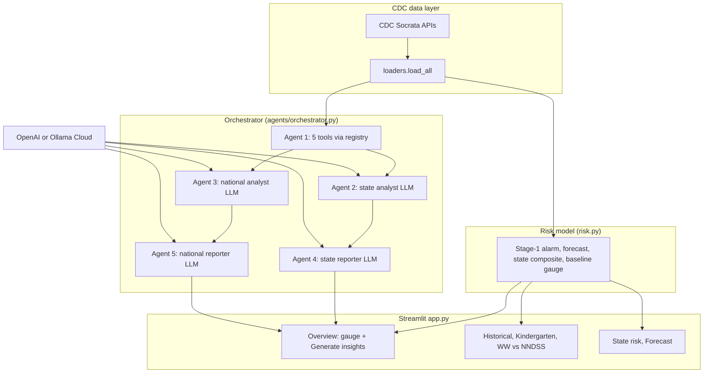

# Tool V3 — system architecture

**Workflow:** Update this document when the shipped pipeline changes; the process diagram should match what you submit in the **TOOL3** package ([`TOOL3_SUBMISSION_PACKAGE.md`](TOOL3_SUBMISSION_PACKAGE.md)). Sources: [`diagrams/architecture.mmd`](diagrams/architecture.mmd) (editable), Mermaid block below (same graph).

## Purpose

The **Predictive Measles Risk Dashboard** (Streamlit) loads CDC surveillance and coverage data, fits a risk model, and presents charts, maps, and forecasts. **Tool V3** delivers **production-ready** behavior on top of prior milestones: CDC-backed **tools** run first; then LLM agents produce state-level and national narratives grounded in tool output and dashboard metrics. Optional **insight QC** and **refinement** loops validate AI outputs when enabled via environment variables.

## High-level flow

1. **Loaders** (`loaders.py`) pull kindergarten coverage, wastewater, NNDSS, and related tables from public CDC endpoints (Socrata).
2. **Risk** (`risk.py`) builds a stage-1 alarm model, national weekly aggregates, **per-state composite scores** (`get_state_risk_df`: coverage + recent cases + wastewater percentiles), **forecast** drivers, and the **Overview baseline gauge** (`get_baseline_risk`). The baseline score can be **harmonized** with the max state composite on the same run so the national meter does not contradict the state table on a shared 0–100 display.
3. **Streamlit** (`app.py`) renders pages: Overview (baseline gauge + optional **Insights** from the orchestrator), Historical, Kindergarten, Wastewater vs NNDSS, State risk, Forecast.
4. **Orchestrator** (`agents/orchestrator.py`) runs **Agent 1** (five registered tools in fixed order), then **Agents 2 and 3 in parallel** (LLM), then **Agents 4 and 5 in parallel** (LLM). **Agent 2** is the state data analyst (tools + state-filtered excerpts). **Agent 3** is the national data analyst. **Agent 4** rewrites Agent 2’s output for a readable **state summary**. **Agent 5** produces the **national summary** prose from Agent 3’s output plus injected **TOP STATES BY COMPOSITE RISK** blocks. User messages prepend **DASHBOARD METRICS**, optional **BASELINE ATTRIBUTION**, and **STATE RISK SNAPSHOT** when a state is selected. **State risk JSON** for agents is recomputed from **Agent 1 tool payloads** when possible so rankings match the same CDC pull as the insights run (not only stale session state). Prompts load from `prompts/*.md` via `prompts/loader.py`. LLM calls go through `ollama_client.py`: **OpenAI** Chat Completions if `OPENAI_API_KEY` is set (optional `OPENAI_MODEL`, default `gpt-4o-mini`), otherwise **Ollama Cloud** with model fallback. Combined system+user prompts are bounded (`MAX_PROMPT_CHARS`); national reporter context orders **ranking blocks before** long tool dumps so truncation does not drop top-state lists.
5. **Contracts** (`contracts/schemas.py`) define `AgentContext`, `AgentResult`, `ToolOutput`, and optional **`InsightQCResult`** (rubric scores when `INSIGHT_QC_ENABLED=1`) for consistent payloads and tests.

## Process diagram (Mermaid)

Editable source and **export instructions** (PNG/SVG for reports): [`diagrams/architecture.mmd`](diagrams/architecture.mmd) and [`diagrams/README.md`](diagrams/README.md).

**Execution order:** Agent 1 → (Agent 2 ∥ Agent 3) → (Agent 4 ∥ Agent 5). Agent 4 is skipped if Agent 2 fails.

## Agent roles

| Agent | Role | Inputs | Output use |
|-------|------|--------|------------|
| 1 | Runs CDC tool wrappers (`child_vax`, `kindergarten_vax`, `teen_vax`, `wastewater`, `nndss`) via `tools/registry.py` | Per-tool parameters | Structured `ToolOutput` payloads in `AgentContext` |
| 2 | State data analyst (optional OpenAI tool calls for leaderboard / national trend / snapshot) | Dashboard metrics + state-filtered rows + `ctx.extra` | Raw analyst text for Agent 4 |
| 3 | National data analyst (optional tools) | Same + compact tool summary | Raw analyst text for Agent 5 |
| 4 | State reporter | Agent 2 text + metrics + excerpts + context | Overview **state summary** (when a state is selected) |
| 5 | National reporter | Agent 3 text + metrics + top-state / tier blocks + context | Overview **national summary** |

## State composite risk (UI + agents)

- **Score:** `total_risk` combines coverage points (0–50), case percentile points (0–30), and wastewater percentile points (0–20) when data exists; caps apply when WW or cases are missing.
- **Tier:** `risk_tier` (**high** / **medium** / **low**) is assigned by **equal-count tertiles** of `total_risk` among 50 states + DC on each run so tier counts stay differentiated when raw scores cluster.

## Tool calling (implementation)

- **Registry:** `tools/registry.py` maps tool names to functions; returns `ToolOutput` aligned with schemas in [`INTERFACE_CONTRACTS.md`](INTERFACE_CONTRACTS.md).
- **Agent 1** invokes all tools deterministically. **Agents 2 and 3** may use **OpenAI function calling** when `OPENAI_API_KEY` is set and structured JSON context is present; handlers read `ctx.extra` (e.g. `state_risk_records_json`, `national_weekly_trend_json`). Otherwise the orchestrator injects the same blocks as plain text (Ollama path).

## Configuration and deployment

- **Local / Connect env:** `SOCRATA_APP_TOKEN` (optional); for LLM set **`OPENAI_API_KEY`** (preferred for tool calling) or **`OLLAMA_API_KEY`**; optional `OPENAI_MODEL`. See `ollama_client.py` and `deployment/deploy_me.py`.
- **Deploy:** Posit Connect via `rsconnect-python`; see [`submission_notes.md`](submission_notes.md).

## Tests

- `tests/test_orchestrator.py` — tool order, parallel agents, state filtering, risk tool dispatch.
- `tests/test_risk_leaderboard.py` — state risk table, baseline harmonization, tier assignment.
- `tests/test_tools_live_parity.py` — tool outputs vs loaders (network).
- Other tests cover registry, schemas, and national activity trend formatting.
