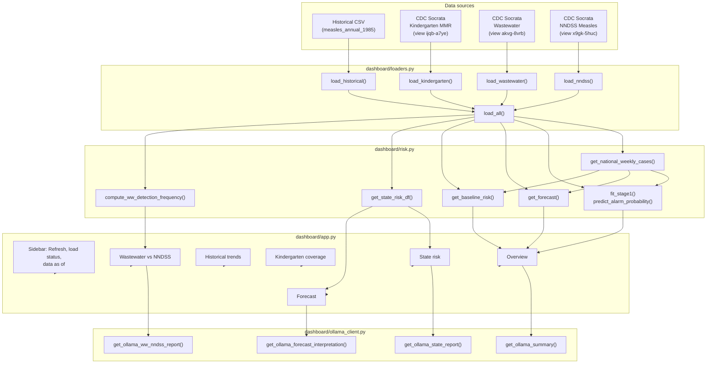
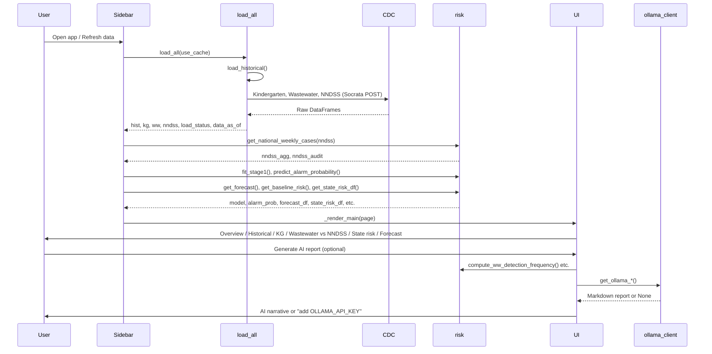
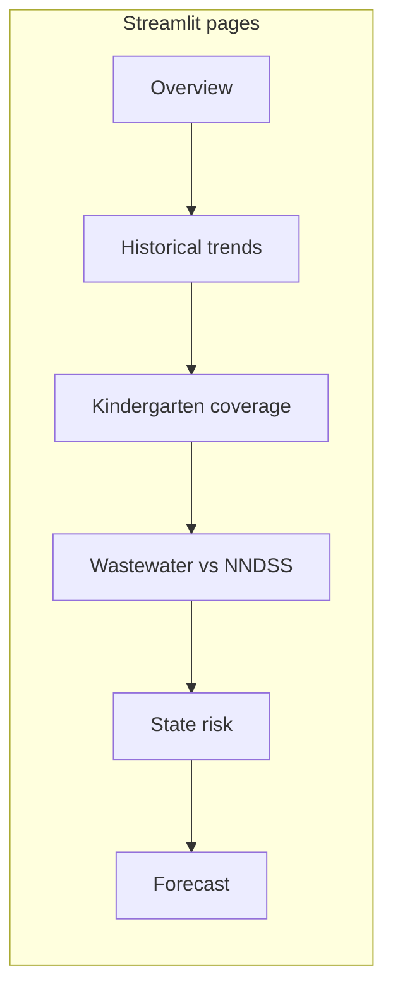

# Predictive Measles Risk Dashboard — Documentation

Comprehensive technical documentation for the **Risk of Measles Outbreak in US** Streamlit dashboard. The app combines CDC data (historical CSV, kindergarten MMR coverage, wastewater, NNDSS) with a two-stage alarm/forecast model and optional AI (Ollama Cloud) interpretation.

**Disclaimer:** For situational awareness only; not for clinical or policy decisions. Data: CDC.

---

## Table of contents

1. [Architecture overview](#architecture-overview)
2. [Data flow](#data-flow)
3. [Data sources](#data-sources)
4. [Risk model](#risk-model)
5. [UI pages](#ui-pages)
6. [AI integration (Ollama)](#ai-integration-ollama)
7. [Dependencies](#dependencies)
8. [File layout](#file-layout)
9. [Environment and configuration](#environment-and-configuration)
10. [Error handling and logging](#error-handling-and-logging)

---

## Architecture overview



- **loaders.py** — Loads historical CSV from repo; fetches kindergarten, wastewater, and NNDSS from CDC Socrata (POST). Per-source try/except; returns DataFrames plus `load_status` and `data_as_of`. In-memory cache (1h TTL); "Refresh data" bypasses cache.
- **risk.py** — Builds national weekly NNDSS series; Stage 1 = logistic regression for outbreak probability (next 4 weeks); Stage 2 = 4–8 week case forecast; baseline risk from historical + recent NNDSS; state risk from kindergarten, NNDSS, and wastewater (per state); wastewater detection frequency and validation.
- **ollama_client.py** — Reads `OLLAMA_API_KEY` from `.env`; POSTs to Ollama Cloud with structured summaries; returns plain-language reports or `None` on failure.
- **app.py** — Streamlit UI: sidebar (page nav, Refresh, load status, data as of); pages: **Overview**, **Historical trends**, **Kindergarten coverage**, **Wastewater vs NNDSS**, **State risk**, **Forecast**.

---

## Data flow



---

## Data sources

| Source | Identifier / path | Key columns / notes |
|--------|--------------------|----------------------|
| **Historical CSV** | `Shiny App V1/measles_annual_1985.csv` (or repo copy under `dashboard/` or project root) | Year, Measles Cases (national, annual). Used for baseline risk. |
| **Kindergarten** | CDC Socrata view `ijqb-a7ye`; filter `vaccine in ('MMR', 'MMR (PAC)')` | State/jurisdiction, school_year (or derived year), coverage/pct columns. Used for state risk and alarm model (national average). |
| **Wastewater** | CDC Socrata view `akvg-8vrb`; filter by `pcr_target` (audited: Measles virus / MEV_WT) | sample_collect_date → year/week; site/sewershed/sample id; pcr_target_avg_conc; ntc_amplify, inhibition_*. Used for national weekly signal (alarm), state weekly signal (state risk), and detection frequency (Wastewater vs NNDSS tab). |
| **NNDSS** | CDC Socrata view `x9gk-5huc`; filter `label in ('Measles, Indigenous', 'Measles, Imported')` | Reporting Area (e.g. US RESIDENTS, state name), year, week, case column (m2/m1/current_week). National aggregation: US RESIDENTS or sum of valid jurisdictions. Used for alarm target, forecast, baseline, state cases. |

Loaders normalize to common names (e.g. `year`, `week`, state-like fields) for the risk layer.

---

## Risk model

### Stage 1 — Outbreak alarm (next 4 weeks)

- **Target:** `outbreak_next_4w` = 1 if total national cases in the **next 4 weeks** exceed a configurable threshold (sidebar), else 0.
- **Features:** Lagged wastewater (lags 1–12 weeks of national weekly signal), kindergarten MMR coverage (national average), seasonality (week of year).
- **Model:** Logistic regression (interpretable coefficients). Time-based split: train on older weeks, test on last 12 weeks; no future leakage.
- **Outputs:** Predicted probability P(outbreak in next 4 weeks); coefficient table (Overview expander and optional Ollama). Validation: AUC-ROC.

### Stage 2 — Case forecast (4–8 weeks)

- **Target:** National case count per week for the next 4–8 weeks.
- **Input:** Recent NNDSS national weekly series.
- **Method:** Simple average of last 12 weeks (point forecast per week ahead).
- **Output:** Table (week_ahead, forecast) shown on Overview and referenced in Forecast tab.

### Baseline risk

- **Input:** Historical annual measles cases (CSV) and recent NNDSS national weekly cases.
- **Logic:** Recent 5-year average vs overall average; ratio drives tier and 0–100 score.
- **Tiers:** low (ratio ≤ 1), medium (1 < ratio ≤ 1.5), high (ratio > 1.5). Score formula in `get_baseline_risk_components()`.

### State risk

- **Input:** Kindergarten coverage by state, NNDSS cases by state (last 4 weeks), wastewater signal by state (last 4 weeks) when available. State keys normalized to state abbreviation via `state_to_abbr()`.
- **Components:**
  - **Coverage risk (0–50 pts):** `max(0, (95 − coverage%) × 2)`.
  - **Case activity (0–30 pts):** Percentile of last-4-week cases vs other states, scaled to 30.
  - **Wastewater activity (0–20 pts):** Percentile of last-4-week wastewater signal by state, scaled to 20; **only for states with wastewater data**.
- **Scoring rules:**
  - If a state **has** wastewater data in the recent window: `total_risk = min(100, coverage_pts + case_pts + ww_pts)`.
  - If a state **does not** have wastewater data: `wastewater_points = 0`, `total_risk = min(80, coverage_pts + case_pts)` — **no rescaling to 100**.
  - **Guardrail:** If `cases_recent == 0` and `ww_recent is None`, then `total_risk = min(total_risk, 60)` (coverage-only cap).
- **Output columns:** state, coverage, cases_recent, ww_recent, wastewater_coverage (bool), coverage_points, case_points, wastewater_points, total_risk, risk_tier, risk_score. Sorted by total_risk descending.

---

## UI pages



| Page | Description |
|------|-------------|
| **Overview** | Outbreak alarm probability (%), baseline risk tier and 0–100 gauge, 4–8 week national forecast summary. Expanders: how alarm is calculated (coefficients), how baseline is calculated. Optional: "Generate AI summary" (Ollama). Download summary CSV. |
| **Historical trends** | Line chart: national annual measles cases (CSV). NNDSS national weekly cases: select "Last 104 weeks", "All available weeks", or a single year; line chart + last 5 rows table. NNDSS data audit expander. |
| **Kindergarten coverage** | Choropleth map and table of MMR coverage by state. Year selector (from school_year or derived). Caption links low coverage to outbreak risk. |
| **Wastewater vs NNDSS** | Year range selectors (From/To). Wastewater data audit expander. "This week (latest in data): X% of sites detected measles RNA." **Main chart:** dual-axis time series — wastewater detection frequency (share of sites) vs NNDSS weekly cases. AI Reporter: "Generate AI report" compares last 8 weeks wastewater trend vs NNDSS trend; plain-language interpretation and cautions. Expander: understanding detection frequency. |
| **State risk** | Choropleth: risk score by state (darker = higher). Table: State, Recent cases, Wastewater signal ("No coverage" when missing), Wastewater coverage (Yes/No), Final score (sorted descending). Expander: how state risk is calculated (coverage/case/wastewater points, tiers, no rescale for missing WW). Per-state AI report: select state → "Generate AI report for this state." |
| **Forecast** | Table: State, Outlook (High / Watch / Low), What's driving it (low coverage, recent cases, wastewater signal). National line: expected cases next 4 weeks. "Generate AI interpretation": Ollama summary with Hotspots (top states by risk score), Outlook, Universal precautions, CDC reference link (measles/about), and key CDC facts. |

---

## AI integration (Ollama)

- **Endpoint:** Ollama Cloud (`https://ollama.com/api/chat`). Requires `OLLAMA_API_KEY` in `.env` (project root or `dashboard/`).
- **Prompts:** Structured text only (no PII). Summary includes alarm probability, baseline tier, forecast summary, state outlooks/hotspots (Forecast), wastewater vs NNDSS trends (Wastewater tab), or single-state risk (State risk tab).
- **Forecast AI:** Instructed to include Hotspots (top states by risk score), Universal precautions (vaccination/MMR, hand hygiene, stay home when sick, masking, seek care), CDC reference (https://www.cdc.gov/measles/about/index.html), and key CDC facts (contagiousness, symptoms 7–14 days, MMR efficacy).
- **If Ollama fails:** Timeout or 4xx/5xx are logged (no key in logs); UI shows "Could not generate (add OLLAMA_API_KEY to .env or check dashboard.log)."

---

## Dependencies

All dependencies are listed in `dashboard/requirements.txt`:

| Package | Minimum version | Purpose |
|---------|-----------------|---------|
| streamlit | 1.28.0 | Web UI |
| pandas | 1.5.0 | DataFrames, CSV, aggregation |
| numpy | 1.21.0 | Numeric operations |
| requests | 2.28.0 | CDC Socrata API (POST), Ollama API |
| python-dotenv | 1.0.0 | Load `.env` (SOCRATA_APP_TOKEN, OLLAMA_API_KEY) |
| plotly | 5.14.0 | Charts (line, bar, choropleth, gauge) |
| scikit-learn | 1.2.0 | LogisticRegression, train_test_split, roc_auc_score |

**Python:** 3.9+ recommended (tested on 3.10+). No other external services required beyond CDC Socrata and (optionally) Ollama Cloud.

---

## File layout

```
dashboard/
├── app.py              # Streamlit entrypoint; page routing, load_and_model(), _render_main()
├── loaders.py           # load_historical(), load_kindergarten(), load_wastewater(), load_nndss(), load_all(), clear_cache()
├── risk.py             # NNDSS national/weekly, Stage 1/2, baseline, state risk, wastewater detection frequency
├── ollama_client.py     # get_ollama_summary(), get_ollama_forecast_interpretation(), get_ollama_ww_nndss_report(), get_ollama_state_report()
├── requirements.txt    # Dependencies (see above)
├── DOCUMENTATION.md    # This file
├── README.md           # Quick start, run, env vars
├── dashboard.log       # Created at runtime; logs (no secrets)
└── utils/
    ├── logging_config.py
    └── state_maps.py   # state_to_abbr(), STATE_TO_ABBR (for choropleth and state key normalization)
```

Project root (parent of `dashboard/`):

- `.env` — SOCRATA_APP_TOKEN, OLLAMA_API_KEY
- `run_dashboard.sh` — Optional: sets PYTHONPATH, runs `streamlit run dashboard/app.py`
- `Shiny App V1/measles_annual_1985.csv` — Historical annual cases (or copy under `dashboard/` or root)

---

## Environment and configuration

| Variable | Required | Description |
|----------|----------|-------------|
| SOCRATA_APP_TOKEN | Yes (for live CDC data) | CDC Socrata API app token. Without it, only the historical CSV may load; kindergarten, wastewater, and NNDSS will show "temporarily unavailable." |
| OLLAMA_API_KEY | No | Ollama Cloud API key. If missing, all "Generate AI…" buttons show an error message suggesting to add the key or check logs. |

`.env` is read from project root and from `dashboard/`. No secrets or PII are logged.

---

## Error handling and logging

- **Logging:** Per-module logger via `dashboard.utils.logging_config`; file `dashboard/dashboard.log` and console; INFO by default. No API keys or PII in logs.
- **Data load:** Each source in try/except; on failure that source returns empty DataFrame and status `"fail"`; sidebar shows "temporarily unavailable" for failed sources.
- **Stage 1:** On fit failure (e.g. insufficient data or no target variance), alarm probability defaults to 0.5 and coefficient table is empty; reason is logged.
- **Stage 2:** On forecast failure, forecast table is empty; UI shows no national forecast line or "Forecast unavailable" where applicable.
- **State risk:** On exception, `state_risk_df` is None; State risk and Forecast tabs show "No state risk table yet… Load Kindergarten and click Refresh data."
- **Ollama:** On timeout or error, client returns None; UI shows the same error message for all AI buttons.
- **App:** Top-level exception handler around main content logs full traceback and shows "Something went wrong. Check the log file (e.g. dashboard/dashboard.log) for details."
