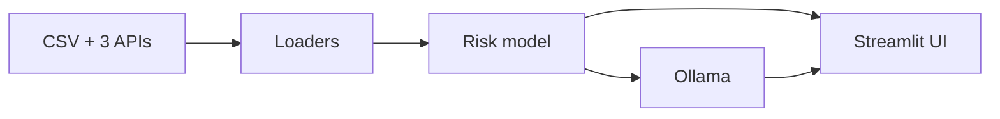

# SIMPLE — Predictive Measles Risk Dashboard

## How to run (step-by-step)

1. Open a terminal and go to the **project root** (the folder that contains `dashboard/` and `Shiny App V1/`).
2. (Optional) Create and activate a virtual environment:  
   `python3 -m venv venv` then `source venv/bin/activate` (Mac/Linux) or `venv\Scripts\activate` (Windows).
3. Put a `.env` file in the project root with at least:  
   `SOCRATA_APP_TOKEN=your_cdc_token`  
   and optionally:  
   `OLLAMA_API_KEY=your_ollama_key`
4. Install dependencies:  
   `pip install -r dashboard/requirements.txt`
5. Run the app:  
   `streamlit run dashboard/app.py`  
   or, from project root:  
   `./run.sh`
6. Open the URL in your browser (e.g. http://localhost:8501).

---

## ELI5 (what the app does)

- We **load** four things: (1) historical national measles cases by year, (2) kindergarten MMR vaccination coverage by state, (3) wastewater measles signal by week, (4) NNDSS reported cases by week and state.
- We run **Stage 1 (Alarm):** a logistic regression that predicts “will there be an outbreak in the next 4 weeks?” using wastewater lags, vaccination coverage, and seasonality. You get a probability (e.g. 30%).
- We run **Stage 2 (Size):** a simple forecast of how many cases per week to expect in the next 4–8 weeks.
- We also compute **baseline risk** (compared to history) and **state risk** (from low coverage and cases).
- We send a short summary of all that to **Ollama**, which gives back a plain-language explanation (e.g. “Risk is moderate because…”).

---

## How to present (talking points and demo order)

1. **Overview first:** Show the three metrics (Alarm probability, Baseline risk, Baseline score) and the 4–8 week forecast table. Mention that “Alarm” comes from a logistic model and “forecast” from recent trends.
2. **Stage 1 (Alarm):** “We ask: will total cases in the next 4 weeks exceed our threshold? The model uses wastewater lags, kindergarten coverage, and seasonality. The number you see is the probability of that happening.”
3. **Stage 2 (Forecast):** “We then forecast how many cases per week to expect in the next 4–8 weeks, using recent NNDSS data.”
4. **Coefficients:** Open the “Stage 1 model drivers” expander and briefly say: “These show what pushes the alarm up or down—e.g. higher wastewater last week or lower vaccination coverage.”
5. **Ollama:** Click “Generate AI summary” and show the short narrative. Optionally go to “AI insight” and ask a follow-up question to show the Q&A.

**Suggested demo order:** Overview → Alarm metric → Forecast table → Coefficients expander → Ollama summary → (optional) AI insight follow-up.

**One sentence for Stage 1:** “Stage 1 is a logistic regression that predicts the probability of an outbreak in the next 4 weeks using wastewater lags, vaccination coverage, and seasonality.”

**One sentence for Stage 2:** “Stage 2 produces a 4–8 week case forecast from recent weekly NNDSS data.”

---

## One-sentence summary of the app

**The app pulls CDC data on measles cases, vaccination coverage, and wastewater, builds an Alarm-then-Size model (logistic regression + forecast), and uses Ollama to explain the results in plain language.**

---

## Optional diagram (data → model → UI → Ollama)

